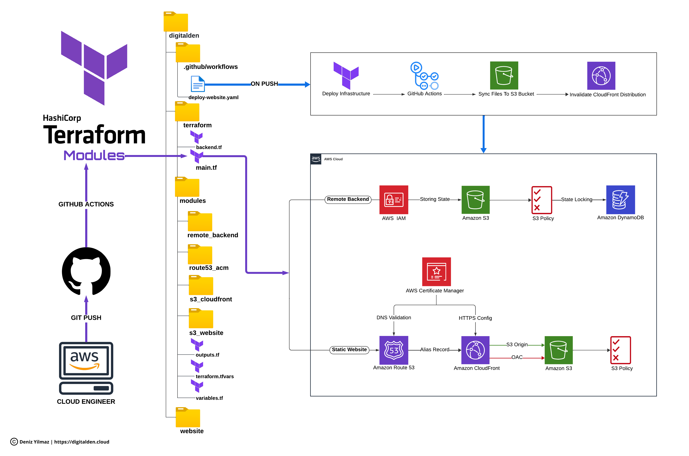

<h1 align="center">Static Web Hosting on AWS Series: Terraform Modules & GitHub Actions</h1>
<h3 align="center"> The Codebase For The 6 Part Youtube Series</h3>

## The Series (6 Parts)

🔗 [View The Playlist Here!](https://youtube.com/playlist?list=PLfmMgg_VrrlAz4s0UxLCdgZlcw2iCqVrD&si=p3g4-633yGeX12wQ)

## Overview

Welcome to the the central hub for all Terraform module templates and GitHub Action YAML files needed for this extensive six-part project.

This series streamlines learning infrastructure as code with Terraform and automating web deployments via GitHub Actions. Dive into deploying a full static website infrastructure, managing DNS, SSL, S3 hosting, and CloudFront distribution with Terraform.

In six parts, you'll master efficient Terraform coding, exploring variables, outputs, and modules. Each of the four key modules builds on the fundamentals of web infrastructure management and demonstrates their interconnectedness to boost your infrastructure. Modules include:

1. S3 Remote Backend
2. DNS settings with Route 53 & AWS ACM
3. S3 Website Hosting
4. CloudFront distribution

You'll learn how to implement a CI/CD pipeline using GitHub Actions. You'll create a workflow with the following jobs:

1. Deploying your infrastructure with Terraform
2. Syncing your files to an S3 bucket
3. Invalidating your CloudFront cache

Whenever you make changes to your website, simply update your content and commit the changes to your repository. The CI/CD pipeline, integrated into this Terraform-managed infrastructure, automatically kicks in. It syncs the new content to the S3 bucket and triggers a CloudFront cache invalidation, ensuring that your website reflects the latest updates promptly.

## Explore The Full Project

[Visit The Complete GitHub Repository](https://github.com/digitalden3/Static-Web-Hosting-on-AWS-Terraform-Modules-GitHub-Actions) for the full project and all the complete code for the 'Static Web Hosting on AWS Series: Terraform Modules & GitHub Actions'.

## Tech Stack

- Terraform
- GitHub
- AWS IAM
- Amazon S3
- Amazon DynamoDB
- AWS ACM
- AWS Route 53
- Amazon CloudFront
